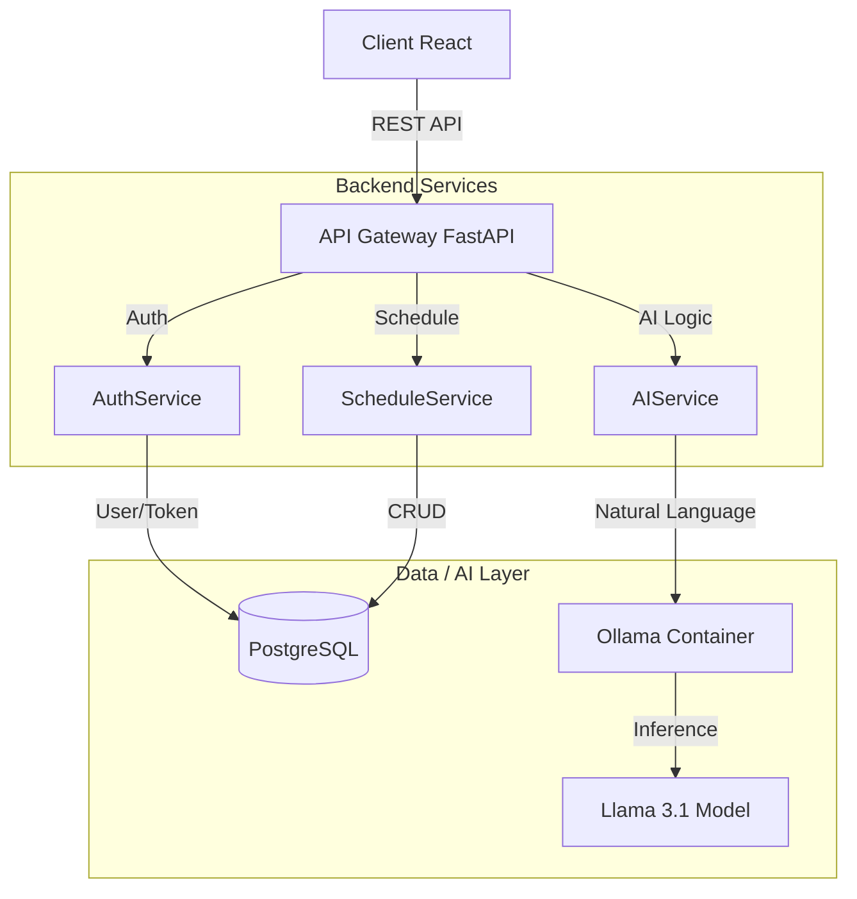

# Jeiary

Jeiary는 사용자의 자연어 입력(텍스트/음성)을 AI가 분석하여 자동으로 일정을 생성하고 관리해주는 지능형 캘린더 애플리케이션입니다. "내일 오후 2시에 팀 미팅 잡아줘"와 같은 명령만으로 복잡한 일정 등록 과정을 단축할 수 있습니다.

## ✨ 주요 기능 (Features)

*   📅 **스마트 일정 관리**: 월간/주간 캘린더 뷰를 통해 일정을 직관적으로 확인하고 관리할 수 있습니다.
*   🤖 **AI 일정 생성**: Llama 3.1 기반의 로컬 AI가 사용자의 자연어를 분석하여 날짜, 시간, 내용을 자동으로 추출해 일정을 등록합니다.
*   🔐  **보안 인증**: JWT Access/Refresh 이중 토큰 기반의 안전한 회원가입 및 로그인 시스템을 제공합니다.
*   🖥️ **반응형 UI**: 데스크탑 및 모바일 환경에 최적화된 반응형 디자인을 제공합니다.
*   🚀 **운영 편의성**: Docker Compose 기반의 One-Command 배포로 손쉬운 개발 및 배포 환경을 제공합니다.

## 🏗️ 아키텍처 (Architecture)

Jeiary는 마이크로서비스 아키텍처를 지향하며, Docker Container를 통해 각 서비스를 격리하여 배포합니다.

*   **Frontend**: React (Vite) 애플리케이션으로 Nginx를 통해 서빙됩니다.
*   **Backend**: FastAPI 기반의 고성능 API 서버로 비즈니스 로직을 처리합니다.
*   **Database**: PostgreSQL을 사용하여 사용자 및 일정 데이터를 안전하게 저장합니다.
*   **AI Engine**: Ollama를 통해 로컬에서 실행되는 Llama 3.1 모델이 자연어 처리를 담당합니다.

## 🛠️ 기술 스택 (Tech Stack)

*   **Frontend**: React, TypeScript, Tailwind CSS, Vite
*   **Backend**: Python 3.11+, FastAPI 0.109.0, SQLAlchemy 2.0.25 (Async), Pydantic 2.5.3, Alembic 1.13.1
*   **Database**: PostgreSQL 15
*   **AI/ML**: Ollama 0.3.x, Llama 3.1 (8B)
*   **Infrastructure**: Docker, Docker Compose

## 🚀 실행 방법 (Getting Started with Docker)

Docker Compose를 사용하여 복잡한 설정 없이 프로젝트를 바로 실행할 수 있습니다.

### 1. 저장소 클론
```bash
git clone <repository-url>
cd Jeiary
```

### 2. 환경 변수 설정
프로젝트 루트에 있는 `.env.example` 파일을 복사하여 `.env` 파일을 생성합니다.

**Windows (PowerShell):**
```powershell
copy .env.example .env
```

**Mac / Linux:**
```bash
cp .env.example .env
```
*필요에 따라 `.env` 파일을 열어 DB 비밀번호나 JWT 시크릿 키 등을 수정할 수 있습니다.*

### 3. 서비스 실행
Docker Compose를 사용하여 모든 서비스를 빌드하고 실행합니다.
```bash
docker-compose up --build
```
*   `--build`: 이미지를 새로 빌드하여 최신 코드를 반영합니다.
*   백그라운드에서 실행하려면 `-d` 옵션을 추가하세요: `docker-compose up -d --build`

### 4. AI 모델 다운로드 (최초 1회)
Docker Compose로 서비스를 처음 실행하면, Ollama 컨테이너가 Llama 3.1 모델을 자동으로 다운로드합니다. 이 과정은 네트워크 속도에 따라 시간이 다소 소요될 수 있습니다 (약 4.7GB).
다운로드 진행 상황은 다음 명령어로 확인할 수 있습니다:
```bash
docker-compose logs ollama -f
```
다운로드가 완료되면 `backend` 서비스가 정상적으로 시작됩니다.

## 🌐 접속 정보 (Access)

서비스가 정상적으로 실행되면 다음 주소로 접근할 수 있습니다.

*   **웹 클라이언트 (Web Client)**: [http://localhost:5173](http://localhost:5173)
*   **API 문서 (Swagger UI)**: [http://localhost:8000/docs](http://localhost:8000/docs)
*   **Ollama API**: [http://localhost:11434](http://localhost:11434)
